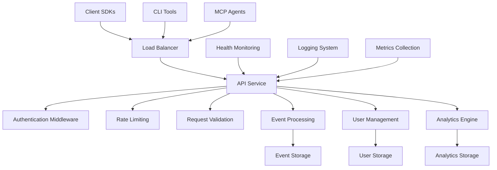
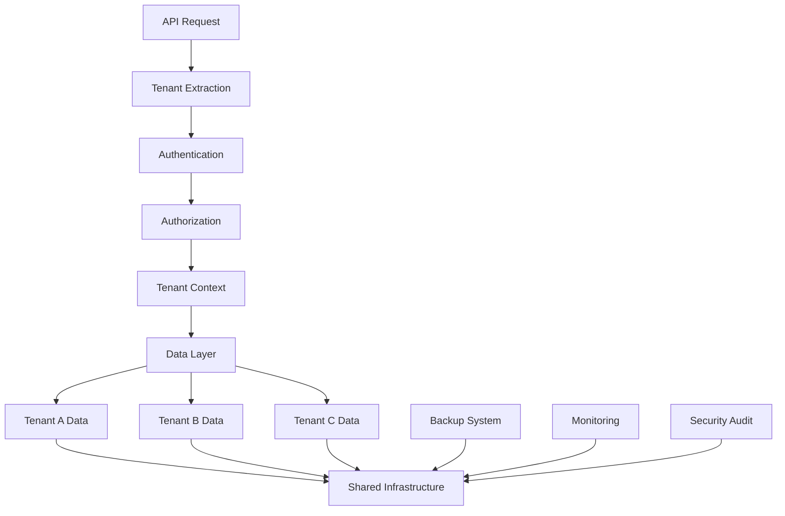

# Nodash Analytics Platform - Monorepo

A scalable, multi-tenant analytics platform built with Node.js and TypeScript. This monorepo contains all services, applications, and shared libraries for the Nodash ecosystem.

## 🏗️ Architecture

### Monorepo Structure

```
nodash-dev/
├── services/           # Backend services
│   └── api-service/   # Core analytics API service
├── apps/              # Frontend applications (future)
├── packages/          # Shared libraries (future)
└── tools/             # Development utilities (future)
```

### Service Architecture



### Multi-tenant Data Architecture



### Deployment Architecture

**Development Environment:**
```
┌─────────────────┐
│ Local Dev Setup │
├─────────────────┤
│ • API Service   │
│ • File Storage  │
│ • In-memory DB  │
│ • Hot Reload    │
└─────────────────┘
```

**Staging Environment:**
```
┌─────────────────┐
│ Staging Deploy  │
├─────────────────┤
│ • Docker        │
│ • PostgreSQL    │
│ • Redis Cache   │
│ • Load Testing  │
└─────────────────┘
```

**Production Environment:**
```
┌─────────────────┐
│ Production      │
├─────────────────┤
│ • Kubernetes    │
│ • HA Database   │
│ • CDN           │
│ • Auto-scaling  │
│ • Monitoring    │
└─────────────────┘
```

## 🚀 Quick Start

### Prerequisites

- Node.js 20.19.0 or higher
- npm (comes with Node.js)

### Installation

```bash
# Clone the repository
git clone <repository-url>
cd nodash-dev

# Install dependencies for all workspaces
npm install

# Build all services
npm run build:all
```

### Development

```bash
# Run the API service in development mode
npm run dev:api

# Run tests across all workspaces
npm run test:all

# Run linting across all workspaces
npm run lint:all

# Format code across all workspaces
npm run format:all
```

## 📦 Services & Applications

### API Service (`services/api-service`)

The core analytics API service that handles event tracking, user identification, and data querying.

**Features:**
- Multi-tenant event tracking
- User identification and profiling
- Real-time analytics queries
- Flexible storage adapters (file-based, database)
- JWT and API key authentication
- Rate limiting and security middleware

**Quick Commands:**
```bash
# Development
npm run dev:api

# Build
npm run build:api

# Test
npm run test:api
```

**Deployment:**
- Docker support with health checks
- Render.com configuration included
- Fly.io configuration included


## 🛠️ Development

### Workspace Commands

The monorepo uses npm workspaces for dependency management. All commands can be run from the root:

```bash
# Install dependencies for all workspaces
npm install

# Build all services and apps
npm run build:all

# Run tests across all workspaces
npm run test:all
npm run test:unit:all
npm run test:integration:all

# Linting and formatting
npm run lint:all
npm run lint:fix:all
npm run format:all
npm run format:check:all

# Type checking
npm run typecheck:all

# Clean build artifacts
npm run clean:all
```

### Working with Individual Services

```bash
# Work on a specific service
cd services/api-service
npm run dev

# Or use workspace commands from root
npm run dev --workspace=services/api-service
```

### Adding New Services

1. Create a new directory in the appropriate folder (`services/`, `apps/`, `packages/`, or `tools/`)
2. Initialize with `package.json` following the naming convention `@nodash/service-name`
3. The workspace will automatically be detected and included

## 🧪 Testing

### Test Structure

- **Unit Tests**: Fast, isolated tests for individual components
- **Integration Tests**: Tests that verify service interactions
- **E2E Tests**: End-to-end tests for complete user workflows

### Running Tests

```bash
# All tests across all workspaces
npm run test:all

# Specific test types
npm run test:unit:all
npm run test:integration:all

# Tests for specific service
npm run test --workspace=services/api-service
```

## 🚀 Deployment

Each service maintains its own deployment configuration:

### API Service Deployment

**Docker:**
```bash
cd services/api-service
docker build -t nodash-api-service .
docker run -p 3001:3001 nodash-api-service
```

**Render.com:**
- Configuration: `services/api-service/render.yaml`
- Automatic builds from git pushes

**Fly.io:**
- Configuration: `services/api-service/fly.toml`
- Deploy with `fly deploy` from service directory

## 🔧 Configuration

### Environment Variables

Each service manages its own environment configuration. See individual service README files for specific variables.

### Shared Configuration

- **TypeScript**: Root `tsconfig.json` provides base configuration
- **ESLint**: Root `.eslintrc.js` provides linting rules
- **Prettier**: Root `.prettierrc` provides formatting rules

## 📚 Documentation

- **API Documentation**: Available in each service directory
- **Architecture Decisions**: Documented in service-specific README files
- **Deployment Guides**: Available in service directories

## 🤝 Contributing

1. **Code Style**: Follow the established TypeScript and formatting conventions
2. **Testing**: Ensure all tests pass before submitting changes
3. **Documentation**: Update README files when adding new features
4. **Commits**: Use clear, descriptive commit messages

### Development Workflow

```bash
# 1. Install dependencies
npm install

# 2. Make your changes
# ... edit code ...

# 3. Run tests and linting
npm run test:all
npm run lint:all

# 4. Format code
npm run format:all

# 5. Build to ensure everything compiles
npm run build:all
```

## 📄 License

MIT License - see individual service directories for specific license information.

## 🔗 Links

- **API Service**: `services/api-service/README.md`
- **Deployment Guides**: Available in each service directory
- **Architecture Documentation**: See service-specific documentation

---